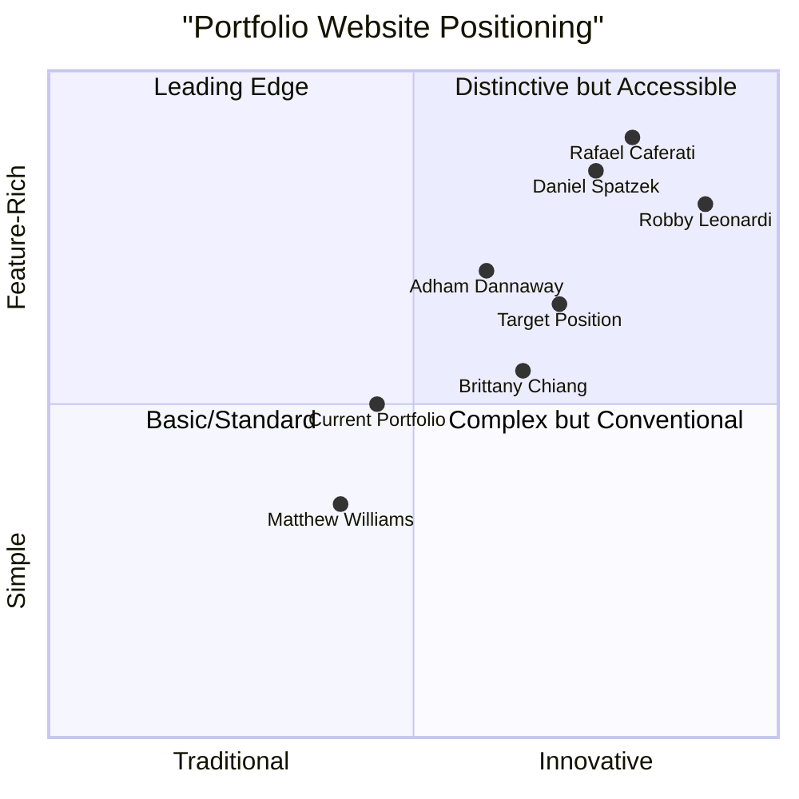

# Portfolio Website Product Requirements Document

**Date:** 2025-05-15  
**Project Name:** portfolio_website_enhancement  
**Author:** Emma, Product Manager  

## Original Requirements

Analyze what makes a great portfolio website and determine if any ideas are missing or can be improved in the current design.

## 1. Product Definition

### 1.1 Product Goals

1. **Showcase Professional Work**: Create a dynamic and engaging platform that effectively presents professional achievements, projects, and skills to potential clients or employers.

2. **Express Personal Brand**: Establish a distinctive online presence that authentically communicates the individual's unique identity, style, and approach to their work.

3. **Generate Opportunities**: Drive user engagement that converts into tangible professional opportunities, including job offers, client inquiries, and networking connections.

### 1.2 User Stories

1. **As a** potential employer, **I want to** quickly assess a candidate's skills and previous work **so that** I can determine if they're a good fit for my open position.

2. **As a** potential client, **I want to** understand the professional's work process and results **so that** I can evaluate if they can solve my specific problems.

3. **As a** visitor on a mobile device, **I want to** easily navigate and experience the portfolio without functionality issues **so that** I can review the work regardless of my device.

4. **As a** recruiter with limited time, **I want to** quickly find contact information and resume details **so that** I can reach out for opportunities without friction.

5. **As a** return visitor, **I want to** see updated content and new projects **so that** I can stay aware of the professional's recent work and growth.

### 1.3 Competitive Analysis

| Portfolio Website | Strengths | Weaknesses |
|-------------------|-----------|------------|
| **Brittany Chiang** | Clean code-focused design; Speed; Unique animations | Limited visual portfolio; Minimal personal branding |
| **Robby Leonardi** | Interactive, game-like experience; Memorable; Creative | Complex implementation; Potential accessibility issues |
| **Daniel Spatzek** | Sophisticated animations; Strong typography; Clear sections | Heavy load time; Complex navigation on mobile |
| **Adham Dannaway** | Strong personal branding; Simple navigation; Clear CTAs | Limited project deep-dives; Minimal use of advanced features |
| **Rafael Caferati** | Technical excellence; Interactive elements; Comprehensive work examples | Potentially overwhelming for non-technical viewers |
| **Matthew Williams** | Clean, minimal aesthetic; Fast loading; Excellent typography | Limited interactivity; Conservative design approach |
| **Current Portfolio** | Modular structure; Clean design; Good technical foundation | Limited interactivity; Standard layout; Few distinctive elements |

### 1.4 Competitive Quadrant Chart

## 2. Technical Specifications

### 2.1 Requirements Analysis

The current portfolio implementation provides a solid foundation with Jekyll, offering good performance and maintainability. The modular structure with section-based components enables flexible content updates, and the site includes key features like sticky navigation and back-to-top functionality.

However, the analysis of market-leading portfolio websites and current design trends reveals several opportunities for enhancement across four key dimensions:

1. **Visual Distinctiveness**
2. **User Engagement**
3. **Content Presentation**
4. **Technical Performance**

### 2.2 Requirements Pool

#### P0 (Must Have)

1. **Performance Optimization**
   * Image compression and optimization
   * Code minification
   * Lazy loading of non-critical resources
   * Performance metrics monitoring

2. **Enhanced Mobile Experience**
   * Perfect responsive behavior across all viewports
   * Touch-optimized navigation
   * Mobile-specific design optimizations

3. **Analytics Implementation**
   * Privacy-focused analytics solution
   * Event tracking for portfolio interactions
   * Conversion tracking

4. **Accessibility Improvements**
   * WCAG 2.1 AA compliance
   * Keyboard navigation
   * Screen reader compatibility
   * Color contrast optimization

5. **Content Restructuring**
   * Project case studies with problem-solution format
   * Skills visualization upgrade
   * Strategic content hierarchy

#### P1 (Should Have)

6. **Micro-interactions**
   * Hover state animations
   * Scroll-triggered effects
   * Form interaction feedback
   * Navigation state indicators

7. **Visual Identity Enhancement**
   * Typography refinement
   * Color scheme evolution
   * Custom cursor implementation
   * Consistent iconography system

8. **Contact Enhancement**
   * Streamlined contact form
   * Alternative contact methods
   * Form submission feedback
   * Scheduling integration option

9. **Content Personalization**
   * Industry-specific content views
   * Visitor-based content prioritization
   * Returning visitor recognition

10. **Social Proof Integration**
    * Enhanced testimonial presentation
    * Work recognition showcase
    * Client/employer logos

#### P2 (Nice to Have)

11. **Advanced Animation**
    * GSAP-powered transitions
    * Scroll-based parallax effects
    * Page transition animations
    * Interactive project showcases

12. **3D Elements**
    * Three.js integration
    * 3D skill visualization
    * Interactive 3D project models
    * WebGL background effects

13. **Dark/Light Mode Enhancement**
    * Unique visual elements for each mode
    * Animation transitions between modes
    * Mode-specific imagery
    * System preference detection

14. **Content Expansion**
    * Blog/thought leadership section
    * Process documentation
    * Personal values/ethics statement
    * Regular updates mechanism

15. **Progressive Web App**
    * Offline availability
    * Install capability
    * Push notifications for updates
    * Performance optimizations

### 2.3 UI Design Draft

The enhanced portfolio website should maintain a clean, minimalist foundation while incorporating distinctive elements that create a memorable experience. The UI should focus on:

1. **Hero Section Reimagining**
   * More dynamic introduction with subtle animation
   * Immediate presentation of professional identity
   * Clear call-to-action
   * Background with subtle movement or interaction

2. **Project Showcase Enhancement**
   * Card-based layout with hover interactions
   * Quick-view project summaries
   * Detailed case study option
   * Filter/sort capabilities

3. **Navigation Evolution**
   * Maintain sticky navigation
   * Add progress indicator
   * Enhance mobile navigation experience
   * Implement smooth section transitions

4. **Skills Visualization**
   * Interactive skill categories
   * Visual skill relationships
   * Progress or proficiency indicators
   * Context for each skill area

5. **Contact Section Optimization**
   * Multiple contact options
   * Form with interaction feedback
   * Social media integration
   * Clear expectations for response

The interface should incorporate a distinct visual language through typography choices, color application, spacing, and interaction patterns that collectively express the individual's professional identity.

### 2.4 Open Questions

1. **Personal Brand Alignment**: How can the visual design better reflect the individual's unique professional identity and career aspirations?

2. **Target Audience Prioritization**: Which audience segments should be prioritized in the design and content strategy?

3. **Content Strategy**: What is the planned frequency for portfolio updates and content refreshes?

4. **Measurement of Success**: What specific metrics will determine the effectiveness of the portfolio enhancements?

5. **Technical Complexity Balance**: How should we balance implementing innovative features with maintaining performance and accessibility?

## 3. Analytics Implementation Recommendation

Based on the requirements for a privacy-focused analytics solution that doesn't require cookie consent, careful consideration should be given to selecting an appropriate analytics platform.

### 3.1 Analytics Solution Requirements

| Feature | Requirements |
|---------|--------------|
| **Cost** | Cost-effective for personal portfolios |
| **Cookie Usage** | No cookies required |
| **Privacy** | High privacy standards with anonymous data collection |
| **Self-hosting** | Option for self-hosting preferred |
| **Data Control** | Full access to raw analytics data |
| **API Access** | API availability for custom integrations |
| **Data Retention** | Long-term data retention capabilities |
| **Real-time Data** | Near real-time or frequent data updates |
| **Customization** | Moderate to high customization options |

### 3.2 Implementation Steps

1. **Platform Selection and Setup**
   * Research and evaluate available analytics platforms
   * Create account and configure dashboard settings
   * Set up tracking subdomain or configuration

2. **Script Integration**
   * Implement in Jekyll's `_includes` structure
   * Add conditional loading for production environment
   * Place script before closing body tag

3. **Configure Advanced Tracking**
   * Set up outbound link tracking
   * Implement file download tracking
   * Configure personal visit exclusion

4. **Verify Implementation**
   * Confirm tracking works after deployment
   * Check dashboard for accurate data collection
   * Test across devices and browsers

## 4. Enhancement Recommendations

Based on the competitive analysis and current trends, the following enhancements would elevate the portfolio website:

### 4.1 Immediate Improvements

1. **Analytics Implementation**
   * Implement privacy-focused analytics solution
   * Set up event tracking for key interactions
   * Create conversion funnels for contact and resume download

2. **Performance Optimization**
   * Optimize images with WebP format and proper sizing
   * Implement code splitting for JavaScript
   * Add lazy loading for below-fold content
   * Target a PageSpeed score of 95+

3. **Distinctive Visual Elements**
   * Refine typography with more distinctive font combinations
   * Implement a signature color accent throughout the interface
   * Add subtle animations for content transitions
   * Create custom illustrated elements that reflect personal brand

4. **Content Enhancement**
   * Restructure project presentations as case studies
   * Add measurable results to project outcomes
   * Create more engaging skills presentation
   * Enhance personal story/journey narrative

### 4.2 Medium-term Evolution

5. **Interaction Design**
   * Implement micro-interactions throughout the interface
   * Create scroll-triggered content reveals
   * Add hover states that provide additional context
   * Design form interactions with immediate feedback

6. **3D Elements Integration**
   * Add subtle 3D elements to selected UI components
   * Create a 3D skills visualization
   * Implement WebGL background effects in key sections
   * Ensure 3D elements degrade gracefully on lower-end devices

7. **Content Strategy Expansion**
   * Add thought leadership content area
   * Implement a "What's New" section for returning visitors
   * Create a visual process documentation area
   * Add downloadable resources related to expertise

### 4.3 Long-term Vision

8. **Advanced Personalization**
   * Implement content personalization based on visitor industry/interest
   * Create alternate navigation paths for different audience segments
   * Add interactive elements that adapt to user behavior
   * Develop tailored messaging for returning visitors

9. **Progressive Web App**
   * Transform portfolio into installable PWA
   * Implement offline capabilities for key content
   * Add update notifications for returning visitors
   * Optimize for lightning-fast performance on all devices

10. **Immersive Experience Elements**
    * Create optional interactive storytelling elements
    * Develop unique interaction patterns that showcase skills
    * Implement subtle sound design elements (user-triggered)
    * Design a cohesive experience that balances innovation with usability

## 5. Conclusion

The current portfolio website provides a solid foundation but has significant opportunities for enhancement to stand out in 2025. The recommendations focus on balancing innovative features with performance and accessibility while creating a more distinctive and memorable experience.

By implementing these enhancements in a phased approach, the portfolio can evolve from a standard professional showcase to a standout representation of skills and identity that effectively converts visitors into professional opportunities.

The key to success will be maintaining focus on the core objectives—showcasing work effectively, expressing personal brand authentically, and generating meaningful professional opportunities—while implementing technical enhancements that support rather than distract from these goals.