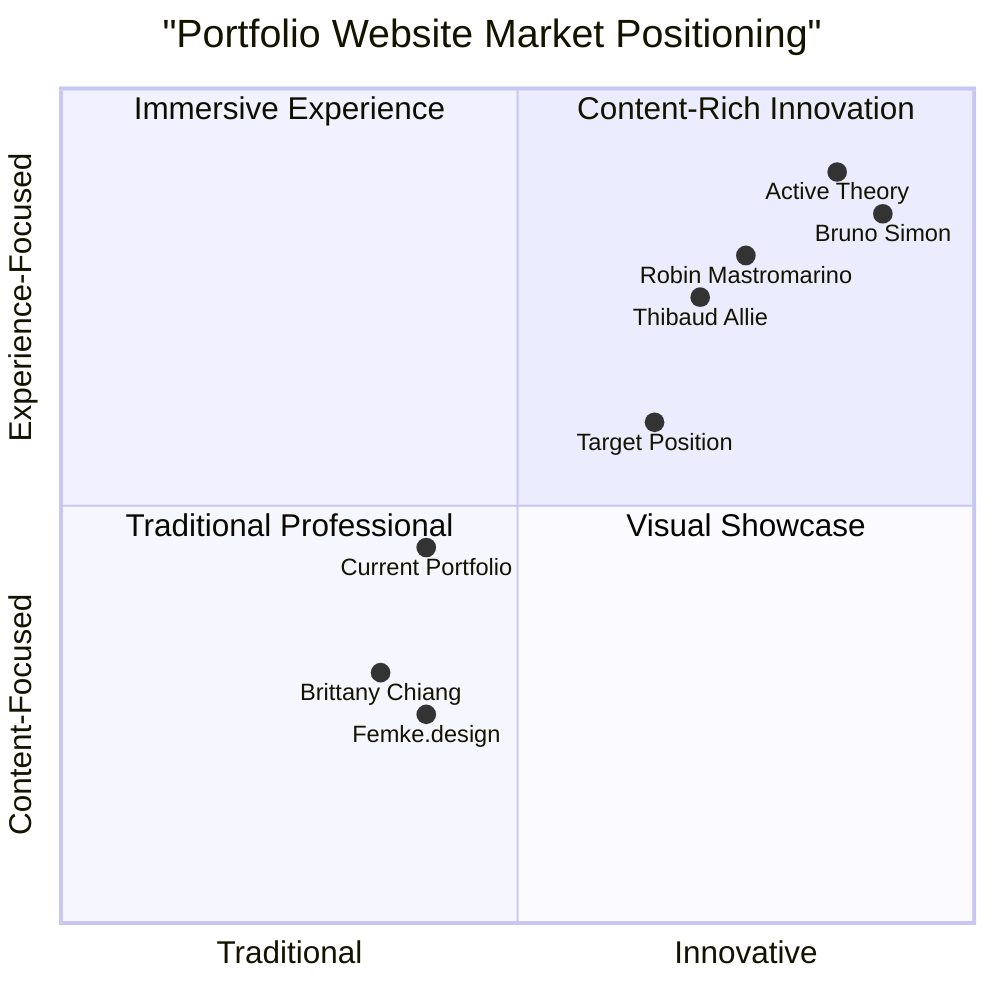

# Portfolio Website Enhancement PRD

**Date:** 2025-05-15  
**Project Name:** Enhanced Personal Portfolio Website  
**Author:** Emma, Product Manager  

## Original Requirements
Analyze what makes a great portfolio website and determine if any ideas are missing or can be improved in the current design.

## 1. Product Definition

### 1.1 Product Goals

1. **Create a Memorable First Impression**: Design a portfolio website that immediately captures visitor attention through distinctive visual elements and interactions that reflect professional identity.

2. **Demonstrate Technical and Creative Excellence**: Showcase skills and expertise not just through portfolio content but through the implementation of the website itself.

3. **Generate Tangible Professional Opportunities**: Convert website visits into meaningful professional connections, job inquiries, or client leads through strategic engagement patterns.

### 1.2 User Stories

1. **As a** potential employer reviewing multiple candidates, **I want to** quickly understand what makes this professional unique **so that** I can determine if they're worth pursuing further.

2. **As a** returning visitor, **I want to** easily find new content or updates **so that** I can stay informed about the professional's recent work.

3. **As a** potential client with specific needs, **I want to** quickly find relevant past projects and results **so that** I can assess if this professional can solve my problems.

4. **As a** visitor using a mobile device, **I want to** experience the portfolio with the same quality and functionality as desktop **so that** I can explore the work regardless of my device.

5. **As a** visitor with accessibility needs, **I want to** navigate and understand all content without barriers **so that** I can fully evaluate the professional's capabilities.

### 1.3 Competitive Analysis

| Portfolio Website | Strengths | Weaknesses |
|-------------------|-----------|------------|
| **Bruno Simon** | Immersive 3D experience; Interactive navigation; Memorable | Resource-intensive; Potential accessibility issues; Complex implementation |
| **Brittany Chiang** | Clean, developer-focused design; Fast performance; Clear information architecture | Limited visual impact; Conservative approach; Minimal interactivity |
| **Thibaud Allie** | Distinctive micro-animations; Strong typography; Cohesive visual identity | Navigation complexity; Limited mobile optimization; Content depth |
| **Active Theory** | Bold visual approach; Cutting-edge technology; Immersive storytelling | Heavy load requirements; Complex implementation; Specialized niche focus |
| **Femke.design** | Content-first approach; Strong case studies; Clear personal branding | Minimal visual distinctiveness; Standard interaction patterns; Limited technical innovation |
| **Robin Mastromarino** | Distinctive cursor interactions; Seamless transitions; Memorable visuals | Performance challenges; Navigation learning curve; Content accessibility |
| **Current Portfolio** | Modular structure; Clean foundation; Good technical base | Standard layout; Limited distinctive elements; Conventional interaction model |

### 1.4 Competitive Quadrant Chart

## 2. Technical Specifications

### 2.1 Requirements Analysis

The current portfolio implementation provides a solid foundation using Jekyll with modular components, responsive design principles, and essential navigation features like sticky navigation and a back-to-top button. However, analysis of leading portfolio websites and emerging design trends for 2025 reveals significant opportunities for enhancement.

These opportunities span five key dimensions:

1. **Distinctive Interaction Design**
2. **Visual Identity Reinforcement**
3. **Content Presentation Innovation**
4. **Performance Optimization**
5. **Personalization Capabilities**

### 2.2 Requirements Pool

#### P0 (Must-Have)

1. **Micro-interaction Implementation**
   * Custom hover states for all interactive elements
   * Animated transitions between page sections
   * Feedback animations for user actions
   * Subtle scroll-triggered animations

2. **Visual Identity Enhancement**
   * Refined typography system with distinctive font combinations
   * Signature color palette with purpose-driven application
   * Custom cursor implementation that responds to context
   * Consistent visual language across all components

3. **Advanced Project Showcases**
   * Case-study format with problem-solution narrative
   * Interactive project galleries with seamless navigation
   * Result-focused outcome presentation
   * Contextual related project suggestions

4. **Performance Optimization**
   * Asset compression and optimization
   * Lazy loading implementation
   * Critical CSS path optimization
   * Core Web Vitals alignment (LCP, FID, CLS)

5. **Privacy-Focused Analytics**
   * GoatCounter implementation
   * Event tracking for key interactions
   * Download and outbound link tracking
   * Conversion measurement framework

#### P1 (Should-Have)

6. **Personalized User Experience**
   * Returning visitor recognition
   * Content ordering based on user interests
   * Referrer-based entry experience
   * Preference persistence

7. **Enhanced Mobile Experience**
   * Mobile-specific interaction patterns
   * Touch-optimized navigation
   * Orientation-responsive layouts
   * Mobile performance optimization

8. **Accessibility Excellence**
   * WCAG 2.1 AA compliance
   * Screen reader optimization
   * Keyboard navigation enhancements
   * Reduced motion options

9. **Content Expansion Strategy**
   * Thought leadership content area
   * Process documentation showcase
   * Skills visualization enhancement
   * Regular update indication system

10. **Social Proof Integration**
    * Enhanced testimonial presentation
    * Work recognition showcase
    * Client/project outcome metrics
    * Interactive reference system

#### P2 (Nice-to-Have)

11. **3D Elements Integration**
    * Three.js selected component enhancement
    * Interactive 3D skills visualization
    * Project showcase 3D models
    * Subtle background effects

12. **Advanced Animation System**
    * GSAP-powered page transitions
    * Scroll-driven narrative elements
    * Canvas-based creative interactions
    * Animation sequencing system

13. **Voice and Gesture Control**
    * Basic voice command navigation
    * Gesture recognition for gallery navigation
    * Accessibility-enhancing alternative inputs
    * Multi-modal interaction options

14. **Progressive Web App Implementation**
    * Offline content availability
    * Installation capability
    * Performance optimization
    * Push notification system for updates

15. **Dark/Light Mode Evolution**
    * Enhanced theme switching animation
    * Mode-specific art direction
    * Time-based mode suggestions
    * System preference synchronization

### 2.3 UI Design Draft

The enhanced portfolio UI should preserve the clean foundation while introducing distinctive elements that create a memorable experience:

1. **Reimagined Hero Section**
   * Dynamic introduction with subtle animation
   * Immediate professional identity communication
   * Background with interactive elements
   * Clear path to key portfolio sections

2. **Enhanced Navigation Experience**
   * Context-aware sticky navigation
   * Visual progress indicators
   * Smooth scroll enhancements
   * Section preview on hover

3. **Project Showcase Evolution**
   * Card-based initial presentation
   * Immersive case study views
   * Interactive project exploration tools
   * Result-focused outcome presentation

4. **Skill Presentation Redesign**
   * Visual skill relationship mapping
   * Interactive expertise demonstration
   * Category-based organization
   * Context-providing skill descriptions

5. **Contact Section Optimization**
   * Multiple contact pathways
   * Form with real-time validation
   * Scheduling integration options
   * Clear response expectation setting

The interface should incorporate a consistent yet distinctive visual language through typography, color application, spacing patterns, and interaction models that collectively express professional identity.

### 2.4 Open Questions

1. **Identity Focus**: How can we balance technical innovation with authentic personal brand representation?

2. **Target Audience Prioritization**: Should the portfolio experience prioritize potential employers, clients, or peers?

3. **Analytics Balance**: How do we gather meaningful insights while maintaining a privacy-first approach?

4. **Performance Prioritization**: Where should we draw the line between interactive richness and performance optimization?

5. **Content Evolution Strategy**: What frequency and approach to portfolio updates will maintain visitor engagement?

## 3. Analytics Implementation Plan

Based on requirements for a privacy-focused analytics solution without cookie consent banners, GoatCounter is recommended as the optimal implementation.

### 3.1 GoatCounter Implementation Benefits

1. **Privacy Compliance**: No cookies or personal data collection
2. **Performance Impact**: Minimal script size (~3KB)
3. **Free for Personal Use**: No cost for portfolios under 100K pageviews/month
4. **Data Ownership**: Access to raw data and export capabilities
5. **Customization**: API access for integration with custom reporting

### 3.2 Implementation Steps

1. **Account Setup**
   * Register at GoatCounter.com
   * Select free personal plan
   * Configure subdomain and site details

2. **Script Implementation**
   * Create `_includes/analytics.html` with conditional loading
   * Add reference in site templates
   * Configure production-only inclusion

3. **Extended Tracking Configuration**
   * Implement outbound link tracking
   * Add file download tracking
   * Configure form submission events
   * Set up project view tracking

4. **Self-Visit Exclusion**
   * Add localStorage-based exclusion option
   * Configure IP-based filtering
   * Document testing approach

## 4. Enhancement Implementation Roadmap

### 4.1 Phase 1: Foundation Enhancement (2-4 Weeks)

1. **Performance Optimization**
   * Image optimization and WebP conversion
   * CSS optimization and critical path extraction
   * JavaScript performance enhancements
   * Lazy loading implementation

2. **Micro-interaction Implementation**
   * Navigation state animations
   * Hover effect system
   * Button and form interaction feedback
   * Scroll-triggered element animations

3. **Analytics Integration**
   * GoatCounter implementation
   * Basic event tracking configuration
   * Dashboard setup and testing
   * Traffic baseline establishment

4. **Visual Identity Refinement**
   * Typography system enhancement
   * Color palette application review
   * Custom cursor implementation
   * Visual consistency audit

### 4.2 Phase 2: Content & Experience Evolution (4-6 Weeks)

5. **Project Showcase Enhancement**
   * Case study format implementation
   * Interactive project galleries
   * Result visualization components
   * Related project suggestion system

6. **Skills Presentation Redesign**
   * Visual skill mapping implementation
   * Interactive expertise demonstration
   * Skill context enhancement
   * Experience timeline evolution

7. **Contact Optimization**
   * Form enhancement with live validation
   * Alternative contact method integration
   * Scheduling tool consideration
   * Response expectation setting

8. **Accessibility Excellence**
   * WCAG 2.1 AA compliance audit
   * Screen reader optimization
   * Keyboard navigation enhancement
   * Reduced motion implementation

### 4.3 Phase 3: Innovation Integration (6-8 Weeks)

9. **Personalization System**
   * Returning visitor recognition
   * Interest-based content ordering
   * Preference persistence implementation
   * Referrer-based optimizations

10. **3D Element Exploration**
    * Three.js integration for selected components
    * Skills visualization enhancement
    * Hero section background evolution
    * Performance-conscious implementation

11. **Advanced Animation Development**
    * GSAP transition system
    * Scroll-driven narrative elements
    * Page transition enhancement
    * Animation orchestration

12. **Content Strategy Expansion**
    * Thought leadership section
    * Process documentation showcase
    * Update indication system
    * Content refresh implementation

## 5. Technical Innovation Opportunities

Beyond standard enhancements, these emerging technologies could create truly distinctive experiences:

1. **WebGL Background Experiences**
   * Subtle interactive backgrounds using Three.js or Pixi.js
   * Performance-optimized shader implementations
   * Visitor interaction responsiveness
   * Theme-integrated visuals

2. **AI-Enhanced Content Personalization**
   * Client-side content reordering based on behavior
   * Interest inference from interaction patterns
   * Dynamic content emphasis adjustment
   * Privacy-preserving implementation

3. **Interactive Storytelling Elements**
   * Scroll-driven narrative components
   * Choose-your-own-adventure project exploration
   * Visual storytelling techniques
   * Engagement-focused interactions

4. **Alternative Input Methods**
   * Basic voice command capabilities
   * Camera-based gesture detection
   * Device orientation interactions
   * Accessibility-enhancing input options

5. **Ambient Information Design**
   * Subtle environmental feedback
   * Background information visualization
   * Peripheral awareness design
   * State communication through environment

## 6. Metrics for Success

The effectiveness of portfolio enhancements should be measured through:

1. **Engagement Metrics**
   * Average session duration
   * Pages per session
   * Scroll depth
   * Interaction rate with portfolio projects

2. **Conversion Metrics**
   * Contact form submissions
   * Resume/CV downloads
   * Email link activations
   * Social profile visits

3. **Technical Performance**
   * Core Web Vitals scores
   * Mobile optimization metrics
   * Accessibility compliance percentage
   * Cross-browser compatibility

4. **Business Outcomes**
   * Professional opportunity generation
   * Interview or meeting conversions
   * Project inquiries
   * Networking effectiveness

## 7. Conclusion

The current portfolio website provides a solid foundation but has significant opportunities for enhancement to stand out in the competitive landscape of 2025. By focusing on distinctive interaction design, cohesive visual identity, innovative content presentation, optimized performance, and thoughtful personalization, the portfolio can evolve from a standard showcase to a memorable professional representation.

The proposed enhancements balance innovation with practical implementation realities, creating a roadmap that can be executed in phases to steadily improve effectiveness. Each enhancement connects directly to the core goals of creating memorable impressions, demonstrating excellence, and generating professional opportunities.

By implementing these recommendations, the portfolio will not only showcase work effectively but also serve as a compelling demonstration of technical capability, design thinking, and professional identity.